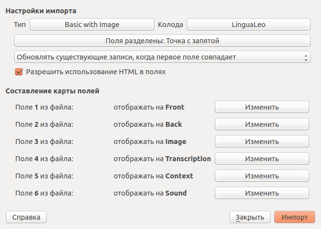

Данное расширение позволяет скачать ваши слова из словаря [LinguaLeo](http://lingualeo.com/), после чего их можно использовать по своему усмотрению. Например, добавить в программу интервальных повторений [Anki](http://ankisrs.net/).

После установки расширения на страницах словаря и словарных наборов появится кнопка «Скачать».

## Что скачивается

- перевод
- ссылка на картинку
- транскрипция
- пример использования (контекст)
- ссылка на mp3-файл с произношением
- наборы слов, в которые слово входит
- пример использования (контекст) для карточек cloze
- ассоциация

## Импорт слов в Anki

### Создайте колоду и тип карточки

Для начала нужно создать в Anki тип карточки.

Простой способ: открыть [файл](LingualeoWords.apkg) через Анки. Добавится пустая колода и тип карточки Lingualeo Card.

Продвинутый способ: [создать тип карточки вручную](card-template)

Это достаточно сделать лишь раз.

### Добавьте слова

Скачайте словарь используя расширение. Можно скачивать весь полностью — существующие карточки обновятся, если нужно, а дубликаты создаваться не будут. Далее в Anki используйте фунуцию импорта из файла (Import File) со следующими настройками:

- Тип карточки (Type): LinguaLeo Card
- "Разрешить использование HTML в полях" (Allow HTML in fields)
- "Обновлять существующие записи.." (Update existing notes when first field matches)

Повторять при появлении новых слов в вашем словаре LinguaLeo
