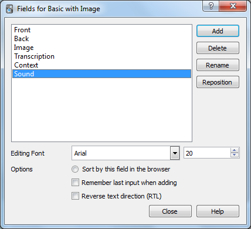
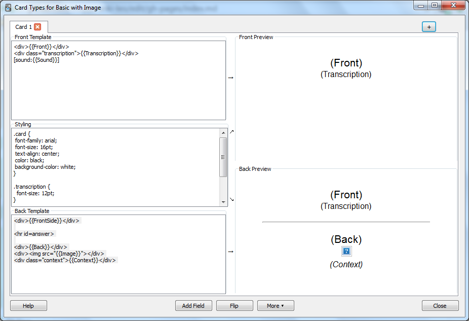

Данное расширение позволяет скачать ваши слова из словаря [LinguaLeo](http://lingualeo.com/userdict), после чего их можно использовать по своему усмотрению. Например, добавить в программу интервальных повторений [Anki](http://ankisrs.net/).

После установки расширения на странице словаря появится кнопка «Скачать».

Для каждого слова скачиваются:

- перевод
- ссылка на картинку
- транскрипция
- пример использования (контекст)
- ссылка на mp3-файл с произношением

# Первоначальный импорт слов в Anki

1. Создайте новый тип карточки в Anki:  
    Tools > Manage Note Types.. > Add 
2. Создайте поля (Fields..) для этого типа карточки:  

3. Измените шаблон карточки (Cards..) по вкусу, чтобы в нём использовались новые поля.  

    За основу можно использовать следующие шаблоны:  
   
    *Front template:*  

    ```raw
    <div>{{Front}}</div>
    <div class="transcription">{{Transcription}}</div>
    [sound:{{Sound}}]
    ```
    
    *Back template:*  

    ```html
    <div>{{FrontSide}}</div>
    <hr id=answer>
    <div>{{Back}}</div>
    <div></div>
    <div class="context">{{Context}}</div>
    ```
   
    *Styling:*  

    ```css
    .card {
      font-family: arial;
      font-size: 16pt;
      text-align: center;
      color: black;
      background-color: white;
    }
   
    .transcription {
      font-size: 12pt;
    }
   
    .context {
      font-style: italic;
      font-size: 12pt;
    }
    ```
    
      

4. Создайте новую колоду (Create Deck), если необходимо
5. Откройте окно импорта слов (Import File) и выберите csv файл, выгруженный с помощью расширения.  
    Проверьте, что выбран новый тип карточки (Type) и нужная колода. Так же проверьте соответствие полей (Field mapping), разделитель и выставите опцию Update existing notes when first field matches, чтобы не создавать дубликаты при обновлении колоды новыми словами.  
    
    
    
6. Нажмите Import

# Добавление новых слов
Через какое-то время в вашем словаре LinguaLeo появятся новые слова. Чтобы добавить их в Anki, скачайте их и просто импортируйте новый файл (шаги 5 и 6). При этом вы можете не беспокоиться из-за дубликатов, поскольку о них позаботится Anki.
